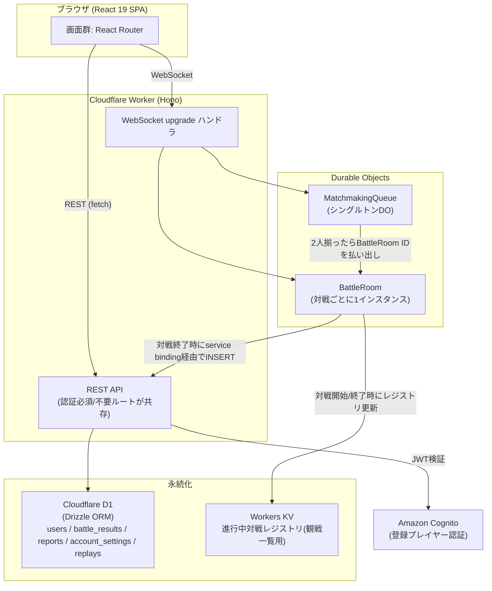

<!-- product-mode: webapp -->
<!-- 変更履歴 [2026-09-18]: 保存期間・退会方式を承認済み方針として確定。PoCの検証範囲、KV整合性、実装前の検証項目を補正。 -->
# VS TETRIS 設計書

- 種別: 設計書

## 目的とスコープ

1vs1のリアルタイム対戦テトリス(webapp)。対戦相手を探して対戦し、観戦もできる。Cloudflare Workers上に [fullstack-worker-template](https://github.com/skanehira/fullstack-worker-template) をベースにして構築する。

**やること**: アカウント登録/ログイン、ゲストプレイ、ランダムマッチング、ルーム対戦、コアゲームプレイ(操作・おじゃまライン攻防)、観戦、対戦結果・履歴・リプレイ、アカウント管理、通報とその確認、初回チュートリアル。

**やらないこと(docs/design/USER_STORIES.md のWon't参照)**: フレンド機能・ランキング/レーティング表示、3人以上のマルチプレイ(バトルロイヤル)、サーバー権威検証を含む高度な不正対策・BAN機能の自動化。これらは将来拡張候補として据え置く。

対象UC(docs/design/USECASES.md): UC-001〜UC-011。

## 承認済みの運用方針

2026-09-18の「進めてください」を、直前に提示した推奨案の採用として記録する。

| 項目 | 決定 |
|---|---|
| 対戦履歴サマリー | 無期限。ただし退会時の本人データ削除を優先する |
| リプレイ | 対戦終了から30日。取得時にも期限を判定する |
| ゲストセッション | 発行から24時間 |
| マッチング待機 | 30秒で継続／キャンセルを提示。自動的な敗北・強制退出にはしない |
| 退会 | 猶予期間なしで削除開始。外部サービス障害時は削除中を表示し、完了と偽らない |

ルームの待機期限10分・再接続猶予15秒は既存の機能設計値であり、上記マッチング待機30秒とは別の値である。

## アーキテクチャと技術選定

fullstack-worker-templateの構成(React 19 + Hono + Cloudflare D1/Drizzle + Cognito)に、テンプレートに無い**リアルタイム対戦層(Durable Objects + WebSocket)**を追加する。docs/design/FEASIBILITY.md のPoC-1〜5はそれぞれの限定されたローカル成功基準でverified。完成アプリの統合試験や本番性能保証を意味しない。テンプレートはPoC報告のcommit `0aa23a2`を基準候補とし、導入時に完全SHA・lockfile・実際の依存バージョンを記録する。

**選定理由**:
- フロントエンド/バックエンドAPI/永続化/認証はテンプレートの既存構成をそのまま踏襲する(PoC-2/PoC-4で共存・書き戻しが可能なことを確認済み)
- リアルタイム対戦・観戦は Cloudflare Durable Objects + WebSocket を新規採用する。PoC-1/PoC-3/PoC-5により、各要素のローカル動作を個別に確認済み。Hibernationと再接続・タイムアウトを組み合わせた統合動作は本実装で検証する
- 進行中の対戦一覧(観戦用)は Durable Objects が自身を一覧化するAPIを持たないため、Workers KVを外部レジストリとして併用する(PoC-5で検証済み)

## 開発・検証コマンド

**現時点でvstetris本体はまだscaffoldされていない**(設計資料とUIプロトタイプが存在する状態)。以下のコマンドは**実測の裏付けの有無で2群に分ける**。セットアップissue(最初のissue)でvstetris本体にテンプレートを導入した後、未検証群を実測して本節を確定させること(DoDに含める)。

### PoCで記録されたコマンド

以下は会話に届いたPoC実行報告による実績。本体リポジトリでの再実行結果ではない。

| コマンド | 報告された結果 |
|---|---|
| `pnpm install --frozen-lockfile` | PoC-2の短い実体パスで成功 |
| `pnpm exec vp lint` / `pnpm exec vp check` | PoC-2で成功。禁止importを注入した対照試験も実施 |
| `pnpm exec vp test --run` | フロント9件成功 |
| `pnpm exec vitest run -c vitest.workers.config.ts` | Worker16件成功 |
| `pnpm exec vp build` | PoC-2で成功 |
| `npx drizzle-kit generate --name add_battle_results` | PoC-4でベースライン作成後に成功 |
| `npx wrangler d1 migrations apply DB --local --persist-to <短い専用パス>` | PoC-4で成功 |
| `npx wrangler dev --port <専用ポート> --persist-to <短い専用パス>` | 各PoCで成功 |

PoC-2ではdevサーバーの5174番ポートへの実HTTP疎通も報告済み。npmによる依存導入はPoC-4での回避策であり、全PoC共通のパッケージマネージャではない。セットアップではテンプレートのlockfileに合わせて一つに固定し、複数lockfileを混在させない。

### セットアップissue完了後に確定する手順

本体未導入のため、以下はセットアップissueの必須DoDである。未実行のコマンドを検証済みとして扱わない。

1. 既存docsを保持して指定テンプレートを導入し、完全SHA・Node・パッケージマネージャのバージョンを固定する。
2. 新規worktreeで依存をlockfileから導入し、サンプル環境変数からローカル設定を作る。必要な秘密値は別途注入し、コミットしない。
3. Docker/Terraformを用意し、テンプレートの `docker compose up -d` と `vp run cognito:setup` を検証する。Cognito成功トークンによるAPI 200とゲストによる401を両方確認する。
4. D1の初期化・既存状態からの差分適用を検証する。dev / migrations / execute は同じworktree専用persist-toを使う。
5. 外部指定ポートで起動し、占有時は失敗する設定を確定する。Playwrightは `reuseExistingServer: false` とし、別worktreeのサーバーを使わない。Wrangler registryと永続化先も分離する。
6. Playwright導入・ブラウザーインストール・起動・実行コマンドを実測して本節へ記載する。2ブラウザー対戦＋別ブラウザー観戦を必須経路とする。
7. 型/lint・フロント・Worker・build・E2Eを実行し、上記コマンドを本体用に確定する。これまでは並列実装の環境が完成したと扱わない。
8. worktree用の除外設定と必要ファイルの供給方法を用意する。プロセス停止は起動したPID／子プロセスだけに限定し、workerd全体を停止しない。

Cloudflareへの実デプロイは未実施。ステージング・本番のD1/KV/DO/Cognitoと秘密値を分離する。

## データスキーマ

Cloudflare D1 + Drizzle ORM。認証はCognitoが担うため、パスワード等の認証情報はD1に持たない。

| テーブル | カラム | 説明 |
|---|---|---|
| `users` | `id`(text, PK, Cognito sub) / `nickname`(text) / `terms_agreed_at`(text) / `created_at`(text) | 登録プレイヤーのアプリ内プロフィール。Cognitoのuser poolとは`id`(sub)で対応。退会は物理削除のため論理削除用カラムは持たない |
| `account_settings` | `user_id`(text, PK/FK→users.id, ON DELETE CASCADE) / `color_support_default`(integer, boolean) / `key_bindings`(text, JSON) / `updated_at`(text) | US-025(アクセシビリティ)の個人設定 |
| `battle_results` | `id`(text, PK, ULID) / `room_id`(text) / `player_id`(text, FK→users.id, ON DELETE CASCADE) / `opponent_id`(text, FK→users.id, nullable, ON DELETE SET NULL) / `opponent_label`(text) / `result`(text: win/lose/draw) / `lines_cleared`(integer) / `lines_sent`(integer) / `duration_ms`(integer) / `ended_reason`(text: normal/forfeit_timeout/draw_timeout) / `created_at`(text) | 登録プレイヤー視点で1行/対戦。相手がゲストの場合`opponent_id`はnull(BR-004: ゲストの対戦結果はそもそも作成しない)。`player_id`本人が退会すると行ごと削除(CASCADE)、相手(`opponent_id`)が退会した場合はその参照だけnull化し行は残す(`opponent_label`は「退会済みプレイヤー」に置換する)。UC-004ステップ11、UC-007に対応 |
| `replays` | `id`(text, PK) / `battle_result_id`(text, FK→battle_results.id, ON DELETE CASCADE) / `room_id`(text) / `version`(integer) / `chunk_count`(integer) / `started_at`(text) / `ended_at`(text) / `created_at`(text) / `expires_at`(text) | UC-007のリプレイ。保存期間30日(既定値、下記「横断規約」参照)。期限切れレコードは定期実行(Cron Triggers)で削除する。`battle_results`行が削除(退会等)されると連動して削除される |
| `reports` | `id`(text, PK, ULID) / `reporter_label`(text) / `target_label`(text) / `room_id`(text, nullable) / `reason`(text) / `detail`(text, nullable) / `created_at`(text) | UC-009/UC-010。通報者の身元確認は行わず`reporter_label`(自己申告の表示名)のみを記録する(`POST /api/reports`は認証不要ルートのため、認証済みユーザーIDとの紐付けは持たない。「自分の通報一覧」のような機能が必要になった場合に`reporter_id`列を追加検討する) |

**インデックス**: `battle_results(player_id, created_at, id)`(履歴の新しい順取得用)、`replays(expires_at)`(期限切れ削除用)、`reports(created_at)`(一覧の新しい順取得用)。

**マイグレーション方針**: drizzle-kitで生成し`wrangler d1 migrations apply`で適用する(テンプレート標準)。PoC-4で確認済みの通り、テンプレートの`migrations/0000_init.sql`は手書きでdrizzleのスナップショット(`migrations/meta/`)を持たないため、セットアップissueで最初にkv_example等の既存テーブルのみでベースラインスナップショットを作成してから、本設計のテーブルを追加すること(「既知の制約」参照)。

### 保存の制約とトランザクション境界

- `battle_results` に UNIQUE(room_id, player_id) を付け、結果再送による二重戦績を防ぐ。再戦は新しいroom_idを使う。
- 履歴取得インデックスは `(player_id, created_at, id)` とし、時刻が同じ場合も安定してページ送りする。
- `replay_chunks(room_id TEXT, chunk_index INTEGER, data TEXT, hash TEXT, expires_at TEXT, PRIMARY KEY(room_id, chunk_index))`を追加する。dataはUTF-8で最大256KiB。replaysはroom_idとversion/chunk_countを持つ本人用参照で、全ログを一行に格納しない。stagingは参照0件でも期限まで保持する。退会で最後の参照が消えるroom_idの削除と期限切れ削除はbattle.md「保存と退会の競合」に従う。
- `replays.battle_result_id` はUNIQUE。expires_atは対戦終了時刻＋30日とし、取得時に期限切れを拒否する。Cron遅延は閲覧期限を延ばさない。
- 時刻はサーバーが発行するUTC ISO8601。数値は非負、result／ended_reasonは列挙値制約、必須列はNOT NULLとする。
- 削除中の識別に `account_deletions(user_id TEXT PRIMARY KEY, phase TEXT, requested_at TEXT, retry_at TEXT, last_error_code TEXT)` を置く。usersへのCASCADEは設定しない。完了後は旧JWTの最大有効期限を過ぎた時点で最小限の失効記録も削除する。

| 処理 | 境界・失敗時の扱い |
|---|---|
| 対戦終了 | DOで結果と未送信状態を永続化してからD1へ渡す。失敗はalarmで再試行。同じ対戦IDを再利用 |
| 結果とリプレイ | チャンクを冪等に転送後、全件検証して登録者分のサマリーとreplays参照だけをD1原子的batchで確定。途中チャンクは非公開。各SQLの束縛変数100個以下を守り、一括巨大INSERTをしない。HTTP成功応答消失後の再送も冪等 |
| 退会 | 最初に削除要求を記録してアクセスを停止。CognitoとD1は分散トランザクションにできないため段階を記録して再試行 |
| 期限切れ削除 | 小さいbatchを繰り返す。取得APIでの期限判定がアクセス制御の正本 |

ゲスト同士の試合は履歴を作らない。登録者対ゲストは登録者の履歴のみ作り、ゲスト側の恒久的な履歴索引は持たない。退会中・退会済みユーザーへの遅延結果書き込みではプロフィールを再生成しない。

## API 一覧

登録プレイヤーの認証(サインアップ・ログイン・パスワード再設定・メールアドレス確認)はCognito Hosted UI/SDKをフロントエンドから直接呼び出す(バックエンドの認証必須ルートは検証済みJWTを前提とする)。以下はHono側に実装するAPI。

| メソッド | パス | 概要 | 認証 | 対応UC |
|---|---|---|---|---|
| GET | `/api/me` | ログイン中プレイヤーのプロフィール取得(テンプレート既存) | 必須 | UC-002 |
| POST | `/api/account/provision` | Cognitoサインアップ完了後にD1側プロフィールを作成(冪等) | 必須 | UC-001 |
| POST | `/api/guest/session` | ゲストセッションCookie発行(既存Cookieがあれば再発行しない) | 不要 | UC-003 |
| POST | `/api/ws-tickets` | WebSocket接続用の短命チケット発行(横断規約「WebSocket認証」参照) | 任意(登録済みならJWT検証、無ければゲストCookie) | UC-003, UC-004, UC-005, UC-006 |
| GET | `/api/account/settings` | アクセシビリティ設定の取得(対戦開始時・設定画面表示時に使用) | 必須 | UC-004(代替B/C) |
| PATCH | `/api/account/settings` | アクセシビリティ設定(色覚サポート既定値・キー割当)の更新 | 必須 | UC-004(代替B/C) |
| DELETE | `/api/account` | 退会(アカウント・個人情報の即時削除、Cognitoユーザーも削除) | 必須 | UC-008 |
| POST | `/api/rooms` | ルーム作成、ルームIDを返す | JWTまたは有効ゲストCookie | UC-005 |
| DELETE | `/api/rooms/:roomId` | 作成者による待機部屋解散 | JWTまたは有効ゲストCookie | UC-005 |
| GET | `/api/rooms/:roomId/result` | 終了通知の回復 | resultReceipt | UC-004 |
| GET | `/api/rooms/active` | 進行中の対戦一覧(観戦用、KVレジストリから取得) | 不要 | UC-006 |
| GET | `/api/battle-results` | 対戦履歴一覧(新しい順)+通算成績 | 必須 | UC-007 |
| GET | `/api/battle-results/:id/replay` | リプレイ取得 | 必須 | UC-007 |
| POST | `/api/battle-results`(内部専用) | BattleRoomからservice binding経由で呼ばれる対戦結果・リプレイの永続化 | 内部シークレットヘッダ | UC-004, UC-007 |
| GET | `/api/battle-results/:id/replay/chunks/:index` | 本人限定リプレイチャンク | 必須 | UC-007 |
| PUT | `/api/internal/replays/:roomId/:chunkIndex` | DOからの冪等チャンク転送 | 内部シークレットヘッダ | UC-004, UC-007 |
| POST | `/api/reports` | 通報の作成 | 不要(ゲスト可) | UC-009 |
| GET | `/api/reports` | 通報一覧(運営者権限必須) | 必須+運営者権限 | UC-010 |
| WS | `/ws/matchmake?ticket=<ticket>` | MatchmakingQueue DOへのWebSocketアップグレード | チケット(横断規約参照) | UC-004 |
| WS | `/ws/rooms/:roomId?role=player\|spectator&ticket=<ticket>` | BattleRoom DOへのWebSocketアップグレード(spectatorはチケット省略可) | チケット(playerのみ必須) | UC-004, UC-005, UC-006 |

個別のリクエスト/レスポンス詳細・WebSocketメッセージ形式は各 docs/design/features/ の「API」節を正本とする。

## 横断規約

- **REST認証方式**: 登録プレイヤーはCognito発行のJWTを`Authorization: Bearer`ヘッダで送信し、既存の`authenticate`ミドルウェア(`src/server/modules/auth/adapter/`)で検証する。**認証必須/不要はルート単位のオプトイン**(ミドルウェアを付けるかどうか)で切り分ける、というテンプレート既存の設計方針をそのまま踏襲する(PoC-2で確認済み。グローバル適用の`app.use("*", authenticate)`は存在しないし追加しない)
- **`playerRef`の型**: `{ "id": string, "kind": "registered"|"guest", "displayName": string }`。`id`は登録プレイヤーならCognito sub、ゲストなら`guest_id`(ULID)。この型はDESIGN.md全体・全featuresで共通のプレイヤー識別子として扱う
- **WebSocket認証(チケット方式)**: `/ws/matchmake`・`/ws/rooms/:roomId`はJWTをURLに直接載せない(ログ残存対策)。接続前に`POST /api/ws-tickets`を呼び、**サーバが解決した`playerRef`を署名して埋め込んだ短命(60秒)・一回限りの署名付きチケット**を取得し、`?ticket=`で接続する。DO側は署名・有効期限・未使用であることを検証する(署名検証に加えてDO storageの消費済みjtiを照合し、検証と消費を直列化する)。これにより「クライアントが`playerRef`を自己申告してなりすます」問題を構造的に防ぐ
  - 認証: **任意認証**(`Authorization: Bearer`があれば`authenticate`相当の検証を行い`playerRef.kind="registered"`を解決、無ければ`guest_id` Cookieを見て`kind="guest"`を解決。どちらも無ければ401)。テンプレートの「認証必須/不要」2値では表現できないため、`optionalAuthenticate`ミドルウェアを新規追加する
  - リクエスト: `{ "scope": "matchmake"|"room", "roomId"?: string, "displayName": string }`(`scope: "room"`のときは接続先の`roomId`を必ず指定し、チケットに埋め込む。登録プレイヤーは`users.nickname`を優先しこの値は無視してもよい。ゲストは必須、features/guest-session.mdと同じ`nicknameFilter`をここで適用する)
  - レスポンス(201): `{ "ticket": string, "expiresAt": string }`
  - エラー: 認証情報なし → 401 `UNAUTHENTICATED`。ニックネーム不正(ゲスト) → 400 `NICKNAME_REJECTED`/`NICKNAME_TOO_LONG`/`NICKNAME_REQUIRED`。`scope: "room"`で`roomId`欠落 → 400 `ROOM_ID_REQUIRED`
  - チケットは`scope`と(`scope: "room"`の場合)`roomId`を含み、対応しないエンドポイント・異なるroomIdへの接続には使えない(BattleRoomは自分の`roomId`とチケット内の`roomId`が一致するかを検証する。roomIdへの束縛だけでは席の予約にならない。マッチ成立時にDOへ予約した2名のplayerRefを保存し、発行時と接続時の両方で一致を確認して第三者の参加を拒否する)。同一チケットでの2本目の接続は拒否する(一回限り)
  - 二重接続の扱いは経路により異なる: MatchmakingQueueは同一`playerRef.id`の新しい接続が来たら**古い接続を切断してキューを差し替える**(features/matchmaking.md参照、UX上のタブ切り替えを許容するため)。BattleRoomは同一`playerRef.id`が既に`role=player`で接続中の場合、**新しい接続を409で拒否する**(対戦中の二重操作を防ぐため。features/battle.md参照)
  - 実装の配置: `src/server/modules/wstickets/adapter/issueTicket.ts`(発行、HMAC署名、`optionalAuthenticate`をここで使う。ニックネーム検証は`modules/shared/domain/nicknameFilter.ts`を利用する)、`src/server/modules/wstickets/domain/verifyTicket.ts`(署名鍵を引数で受け取る純粋関数。DO側から呼ぶ)
- **ゲストの識別**: `/api/guest/session`が発行する署名付き・Path=/api・HttpOnly/Secure(本番のみ。開発環境では環境変数で無効化)/SameSite=LaxのCookie(`guest_id`)で識別する。有効期限は既定24時間(PoCで採用した値をそのまま正式採用)。BattleRoom DOは接続時に`playerRef`をstorageへ保持するため、**対戦が始まった後の対戦セッション自体はCookie状態に左右されない**。ただし再接続には新しいチケットが必要であり、チケット発行(`POST /api/ws-tickets`)には有効な`guest_id` Cookieが必要になる。guest-session.mdで署名検証・固定期限・期限表示を定義する。失効後は同一ゲストで再接続できず、切断猶予による決着になる
- **なりすまし対策の分担**: WebSocketメッセージ上のプレイヤー識別は`side`("P1"|"P2")を用い、**`side`はBattleRoom DOが予約時に固定する一意の権威値**とする(`/ws/matchmake`の`matched`メッセージは`side`を含まない。実際の`side`は`/ws/rooms/:roomId`接続後の`joined`メッセージで受け取る)。`playerRef.id`はチケット発行時にサーバが解決した値のみを信頼し、クライアントからの自己申告は使わない
- **運営者権限**: Cognito user poolの管理者グループ(例: `admins`)所属をJWTのグループクレームで判定する。通報一覧(`GET /api/reports`)はこの判定に失敗した場合、UI_SKETCH.htmlで実装済みの「権限なし」画面に相当する403を返す
- **WebSocket接続の役割分離**: BattleRoomへの接続は`role=player`(最大2名、**3人目以降はWebSocketアップグレード自体をHTTP 409で拒否**)と`role=spectator`(無制限、チケット省略可)をクエリパラメータで区別する(PoC-5で実装・検証済み)。BattleRoomはWebSocket Hibernation API(`ctx.acceptWebSocket`/`getWebSockets`)で実装する(PoC-5で採用・検証済み。既知の制約の注意点を参照)。roomId・チケットが不正な接続の拒否方法はfeatures/battle.md「API」節で確定する
- **BattleRoomの状態**: 初期化済みwaiting→in_progress→settling→finished。詳細はbattle.mdを正本とする。入室期限はDO初期化時からrandom15秒／private10分で、接続によって延長しない。未初期化DOは入室不可。game_overは100ms判定窓で同時敗北を決める。

- **WebSocketエラー応答形式**: `{ "type": "error", "code": "<UPPER_SNAKE>", "message": "<日本語メッセージ>" }`(REST側のエラーコード命名規則に揃える)
- **マッチメイキングタイムアウト**: 待機開始から**30秒**(既定値)経過しても成立しない場合、UI側で「待機継続/キャンセル」を提示する(UC-004 E1)。同一`playerRef.id`同士はペアにしない(自己対戦の防止)
- **対戦の再接続猶予**: 通信切断検知から**15秒**(features/battle.mdで確定)再接続を待ち、猶予超過で不戦勝/引き分け処理を行う(UC-004 E2〜E4、PoC-1で実装パターンを検証済み)。この猶予は`in_progress`中の切断のみに適用し、`waiting`中の切断(即時解散として扱う)には適用しない
- **エラー応答形式(REST)**: `{ "error": { "code": "<UPPER_SNAKE>", "message": "<日本語メッセージ>" } }`(テンプレート既存の`/api/me`実装に準拠)
- **Durable Objectの配置とlint境界**: DO本体(`src/server/<name>/`、例: `src/server/battle/battleRoom.ts`)は`src/server/modules/`配下のレイヤ境界lintの対象外の独立層として扱う。DOから`modules/<feature>/domain/`の純粋関数(例: `garbageCalculator`)、および`modules/<feature>/adapter/`のうち**単純なデータアクセス関数(KV/D1の読み書きをラップしたもの)**をimportすることは許可する。禁止するのはHonoの**ルート定義(HTTPハンドラ)**への依存のみ(方向性は「DO→domain、DO→adapterのデータアクセス関数」で、「DO→adapterのHTTPハンドラ」は禁止)
- **Workers KVのキー空間**: `match:<roomId>`のみを観戦一覧候補として使う。randomはwaitingから、privateはin_progressから掲載。観戦者増減・状態変化を集約更新し終了時削除する。room_createdキーは不要。作成・期限の正本はDO。TTL120秒、継続中は30秒ごとに更新要求を出し、同一キーの書き込みを1秒以上に集約する。KV障害時に一覧から一時消えることは許容し、既存対戦は継続する。

- **グローバルトースト/ローディング/404・権限なし・ネットワークエラー画面/ErrorBoundary**: docs/design/UI_SKETCH.html のフェーズ4.5(アプリシェル方針)で確定済みの内容をそのまま採用する。詳細はUI_SKETCH.html「概要」タブを参照
- **データ保持期間**: 対戦履歴(`battle_results`)は無期限保持、リプレイ(`replays`)は**30日**で自動削除(既定値)、退会は即時削除(猶予期間なし、既定値。D1の`users`行に加えCognito側のユーザーもAdminDeleteUserで削除する)

### 運用方針の適用

承認済み方針は「承認済みの運用方針」節を正本とする。退会時は個人データの削除が無期限保持より優先する。削除要求後はプロフィール再作成・チケット発行も拒否する。署名だけ有効な旧JWTを認可の根拠にしない。Cognito・D1の両方で完了してから削除完了と表示する。

### KVレジストリの整合性

KVは候補一覧にのみ利用する。存在・席・開始可否・期限の正本はBattleRoom DOであり、KVの存在やTTLで入室を認可しない。DOには作成時刻・expiresAt・入室経路・予約参加者を保存する。

同一キーへの更新は1秒以上の間隔にまとめ、失敗した更新は最新状態のみ再試行する。finishedを永続化した後に再作成しない。matchキーはTTL付きで更新し、停止した部屋が永久に残らないようにする。UIの5秒ポーリングは5秒以内の反映保証ではない。古い候補への接続はDOが拒否し「対戦は終了しました」と表示する。具体的な集約更新・TTL実装は機能設計の結合試験で確認する。

## インフラ

- **デプロイ先**: Cloudflare Workers(`wrangler deploy`)
- **Durable Objects**: `MatchmakingQueue`(シングルトン、`idFromName("global-queue")`)、`BattleRoom`(対戦ごとに1インスタンス)。いずれも`wrangler.jsonc`の`durable_objects.bindings`にクラスを登録し、`migrations`配列で`new_sqlite_classes: ["MatchmakingQueue", "BattleRoom"]`を指定する(Cloudflare Workersの標準的なDO登録方式。PoC-1/PoC-3/PoC-5でこの方式のDOを実際に動作させ検証済み)
- **Workers KVのキー・同期タイミング**: 横断規約「Workers KVのキー空間」参照(正本はそちら。ここでは重複記載しない)
- **Service Binding(自己参照)**: BattleRoom DOが対戦終了時にHono API(`POST /api/battle-results`内部専用)を呼ぶため、`wrangler.jsonc`の`services`にWorker自身への self service binding(例: `{ "binding": "API", "service": "vstetris" }`)を登録する(PoC-4のbattle-result-persistence実装で採用したパターン)
- **D1**: 1つのデータベースをテンプレート標準構成のまま使用
- **認証基盤**: Amazon Cognito User Pool(本番)。ローカル開発はmoto+Terraformでのモック(テンプレート標準、`docker compose up -d` + `vp run cognito:setup`)。退会時のAdminDeleteUser呼び出しにはCognito管理API用の認証情報(`COGNITO_ADMIN_ACCESS_KEY`/`COGNITO_ADMIN_SECRET_KEY`/`COGNITO_REGION`/`COGNITO_USER_POOL_ID`環境変数、値は未確定でセットアップissueでmotoとの疎通を確認しつつ確定する)が必要
- **定期実行**: リプレイの期限切れ削除にCloudflare Cron Triggersを使用する(最小間隔1分の制約は影響しない用途)

### リリース前の確認

PoC未実施のCloudflare実環境RTT、Cognito成功系、Hibernation後の再接続／alarm復帰、パケットが黙って途絶えるケースのheartbeat、保存再試行、退会失敗復旧を結合試験に含める。ローカル1.6msをインターネット性能として扱わない。

CIでは型/lint、単体・Workerテスト、ビルド、Playwrightを実行する。ログにはrequestId・roomId・結果保存再試行回数を出し、JWT・Cookie・チケット・パスワードは記録しない。保存失敗・削除ジョブ滞留・WebSocket異常切断を監視対象とする。

## 既知の制約

- **Durable Objectsのキュー操作は`storage`以外の`await`を挟むと入力ゲートが解放されlost updateが発生する**(PoC-3で実測)。MatchmakingQueueのキュー更新(read-modify-write)は`state.blockConcurrencyWhile()`で必ず包むこと。守らないと複数人が同時にマッチング待機した際、誰もペアにならない不具合が発生する
- **BattleRoomの`webSocketClose`ハンドラ内で`getWebSockets()`を呼ぶと、切断中のソケットがまだ含まれ観戦者数カウント等がずれる**(PoC-5で実測)。close対象のソケットを明示的に除外して集計すること
- **対戦終了(`battle_end`)によるKVレジストリ削除の直後に、`webSocketClose`のレジストリ同期処理がエントリを再作成してしまう競合がある**(PoC-5で実測)。DO storageに`finished`フラグを永続化し、終了後は常に削除する実装にすること
- **Durable ObjectsはインスタンスをAPIから直接列挙できない**。進行中の対戦一覧はDOの自己申告(KVへの登録)に依存するため、KVへの書き込みタイミングの取りこぼしがあると一覧に反映されない。横断規約「Workers KVのキー空間」に列挙したタイミングで確実にKVを更新すること(タイミングの正本は横断規約側。ここでは繰り返さない)
- **Windows開発環境でのMAX_PATH(260文字)制限**: リポジトリを深い階層に置くとpnpmの入れ子`node_modules`でesbuildが`ENOENT`になる、またはminiflareのD1/KV実体ファイルパスが超過して`internal error`になる(いずれもPoC-2/PoC-4/PoC-5で実際に踏んだ)。プロジェクトは浅いパスに置き、依存管理はセットアップでテンプレートのlockfileに統一する。npmへの変更はPoCの回避策であり一律に強制しない。wrangler dev/d1 execute/d1 migrations applyには短い`--persist-to`パスを指定する
- **git `core.autocrlf=true`のままfullstack-worker-templateをcloneすると、素の状態でも`vp check`のフォーマットチェックが全ファイルCRLFで失敗する**(PoC-2で実測)。`core.autocrlf=false`でcloneすること
- **本番相当のレイテンシは未検証**: PoC-1のレイテンシ計測(片道平均1.6ms)はローカルループバック(`wrangler dev`)でのものであり、クライアント〜Cloudflareエッジ間の実際のインターネットRTTを含まない。本番デプロイ後に実RTTを含めた再計測を行うこと
- **BattleRoomはWebSocket Hibernation APIで実装する**: PoC-1は通常のWebSocket API(`server.accept()`)で切断検知・タイムアウトのパターンを検証し、PoC-5はHibernation API(`ctx.acceptWebSocket`/`getWebSockets`)で対戦者+観戦者のブロードキャストを検証した。本実装は接続数最適化のためHibernation APIに統一する(`getWebSockets()`の注意点は上記の既知の制約を参照)
- **Cloudflare D1は1クエリの束縛変数が100個まで**。IN句は同じSQLの他のパラメータ分も差し引いて分割すること。文字列・BLOB・行の上限2,000,000バイトに対し、リプレイは最大256KiBのチャンク行に分ける

## 未解決の論点

保存期間・ゲスト期限・待機提示・退会開始方式は承認済み。通報本文・自己申告表示名の保持期間と退会時の削除範囲は公開前に確定する必要がある。自己申告名のみでは確実な本人照合ができると約束しない。以下の既存方針は維持する。

- UC-009 BR-001(重複通報の制限有無)は「MVPでは無制限(すべて記録)、濫用が実際に問題化した場合に検討する」で確定済み(docs/design/features/report.md参照)
- UC-008 BR-002(退会後の再登録可否)は、退会時にD1の`users`行だけでなくCognito側のユーザーもAdminDeleteUserで削除する方針(横断規約「データ保持期間」参照)により解消済み: 同一メールアドレスでの再登録は制限なく可能になる

## 技術資料の確認元

- [Workers KVの整合性](https://developers.cloudflare.com/kv/concepts/how-kv-works/): 遠隔拠点への反映には60秒以上かかる場合があり、ローカルPoCでの即時一致は本番保証にならない。
- [DO WebSocket Hibernation](https://developers.cloudflare.com/durable-objects/best-practices/websockets/): 復帰時はコンストラクターが再実行されるため、対戦状態は永続化し接続情報はattachmentから復元する。

### 設計レビューによる補足
- Cookieを使う作成・取消APIはOriginを確認する。署名鍵はゲストCookie用とWebSocketチケット用を分けてsecretに置く。
- roomチケットにはrole(player/spectator)も束縛し、発行時・接続時の両方で照合する。リクエストのrole省略時はplayer。spectatorは参加者予約照合の対象外で、private waitingへの接続は拒否する。匿名spectatorはチケット不要。
- roomチケット発行RESTは存在／期限404、席不適合／満室409を返す。ブラウザーWebSocket APIのupgrade失敗からHTTPステータスは取得できないため、それ以後の競合失敗は共通エラーとして扱う。
- [D1制限](https://developers.cloudflare.com/d1/platform/limits/)、[KV制限](https://developers.cloudflare.com/kv/platform/limits/)、[DO state API](https://developers.cloudflare.com/durable-objects/api/state/)を2026-09-18に照合した。blockConcurrencyWhileは短い状態更新だけに使い、長いRPC待機を含めない。

### 第2回設計レビューの補正
replay_uploads(room_id TEXT PRIMARY KEY, status TEXT, ended_at TEXT, expires_at TEXT)を追加。statusはstaging/finalized/discarded。結果公開・退会・遅延PUTの条件はbattle.md「保存と退会の競合」を正本とする。
ゲストWSチケットの期限はguest.expiresAtを超えない。初回入室expiresAtはwaitingだけに適用し、進行中の本人復帰は固定席・世代・disconnectDeadlineで判定する。
終了通知の回復はbattle.mdのresultReceiptを使う。DOの結果回復用保持は終了後24時間。DO録画は転送成功／破棄時、未成功でも終了後30日で削除する。
