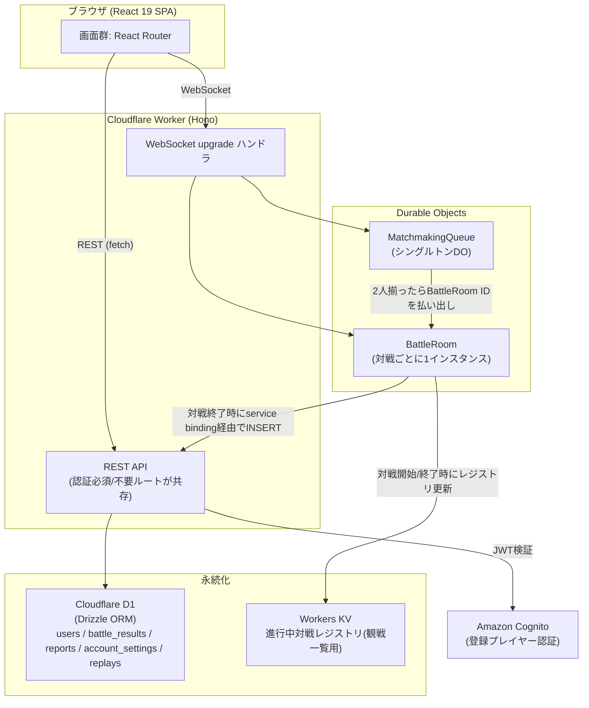

<!-- product-mode: webapp -->
# VS TETRIS 設計書

- 種別: 設計書

## 目的とスコープ

1vs1のリアルタイム対戦テトリス(webapp)。対戦相手を探して対戦し、観戦もできる。Cloudflare Workers上に [fullstack-worker-template](https://github.com/skanehira/fullstack-worker-template) をベースにして構築する。

**やること**: アカウント登録/ログイン、ゲストプレイ、ランダムマッチング、ルーム対戦、コアゲームプレイ(操作・おじゃまライン攻防)、観戦、対戦結果・履歴・リプレイ、アカウント管理、通報とその確認、初回チュートリアル。

**やらないこと(docs/design/USER_STORIES.md のWon't参照)**: フレンド機能・ランキング/レーティング表示、3人以上のマルチプレイ(バトルロイヤル)、サーバー権威検証を含む高度な不正対策・BAN機能の自動化。これらは将来拡張候補として据え置く。

対象UC(docs/design/USECASES.md): UC-001〜UC-011。

## アーキテクチャと技術選定

fullstack-worker-templateの構成(React 19 + Hono + Cloudflare D1/Drizzle + Cognito)に、テンプレートに無い**リアルタイム対戦層(Durable Objects + WebSocket)**を追加する。docs/design/FEASIBILITY.md のPoC-1〜5(全件verified)がこの構成の実現可能性を裏付けている。



**選定理由**:
- フロントエンド/バックエンドAPI/永続化/認証はテンプレートの既存構成をそのまま踏襲する(PoC-2/PoC-4で共存・書き戻しが可能なことを確認済み)
- リアルタイム対戦・観戦は Cloudflare Durable Objects + WebSocket を新規採用する。PoC-1/PoC-3/PoC-5により、マッチメイキング〜対戦同期〜切断復帰〜観戦ブロードキャストの一連の流れが実現可能であることを実測で確認済み
- 進行中の対戦一覧(観戦用)は Durable Objects が自身を一覧化するAPIを持たないため、Workers KVを外部レジストリとして併用する(PoC-5で検証済み)

## 開発・検証コマンド

**現時点でvstetris本体はまだscaffoldされていない**(このリポジトリは空の状態でdev-specの設計フェーズのみ完了)。以下のコマンドは**実測の裏付けの有無で2群に分ける**。セットアップissue(最初のissue)でvstetris本体にテンプレートを導入した後、未検証群を実測して本節を確定させること(DoDに含める)。

**検証済み(docs/design/FEASIBILITY.mdのPoC-2・PoC-4で実際に実行し出力を確認済み)**:

```bash
npm install                 # 依存インストール(PoCではpnpmの深い入れ子構造がWindowsのMAX_PATH制限に抵触したためnpmのフラットnode_modulesを使用。既知の制約参照)
npx vp lint                 # レイヤ境界(Clean Architecture依存方向)のlintを含む。PoC-2で実行しEXIT=0を確認
npx vp check                # 型チェック・lint・フォーマット確認。PoC-2で実行しEXIT=0を確認
npx vp build                # 本番ビルド。PoC-2で実行しEXIT=0を確認
npx drizzle-kit generate    # マイグレーション生成。PoC-4で実行確認(--nameフラグの要否は未確認)
npx wrangler d1 migrations apply DB --local --persist-to <短いパス>   # PoC-4で実行し適用を確認
```

**未検証(セットアップissueで疎通確認すること。DoDに含める)**:

```bash
docker compose up -d        # moto(Cognito IDPモック)起動。PoC-2ではDocker未導入のため未実施
npx vp run cognito:setup    # moto上にUser Pool/Clientをプロビジョニング。同上未実施
npx vp dev                  # フロント+API起動。ポート番号(README記載は5173)・起動可否とも未実測
npx vp test --run           # フロントテスト。PoC-2で「9件pass」という報告はあるが実行コマンド自体は未記録
npx vitest run -c vitest.workers.config.ts   # バックエンド(Worker)テスト。設定ファイル名は未確認、セットアップissueで実際のコマンドを確認する
npx playwright test         # E2E。各features/のテスト方針がgolden pathのPlaywright E2Eを前提とするが、テンプレートへの同梱有無・設定は未確認。セットアップissueで導入可否を確認する
```

**未実施(本フェーズの検証対象外)**:

```bash
wrangler deploy              # Cloudflareアカウントへのデプロイ。FEASIBILITY.mdの全PoCで意図的に未実施
```

**worktreeセットアップ手順**: セットアップissueのDoDで、チェックアウト直後(依存・.env系なし)から `npm install` → dev serverが起動し、DoDが実行可能であることを確認すること。dev serverのポートを外部から指定する方法(環境変数か起動引数か)は`vp dev`の実装依存のため、セットアップissueで確認して本節に追記する。複数worktreeでの並列実装時にポートが衝突しないようにすること。

## データスキーマ

Cloudflare D1 + Drizzle ORM。認証はCognitoが担うため、パスワード等の認証情報はD1に持たない。

| テーブル | カラム | 説明 |
|---|---|---|
| `users` | `id`(text, PK, Cognito sub) / `nickname`(text) / `terms_agreed_at`(text) / `created_at`(text) | 登録プレイヤーのアプリ内プロフィール。Cognitoのuser poolとは`id`(sub)で対応。退会は物理削除のため論理削除用カラムは持たない |
| `account_settings` | `user_id`(text, PK/FK→users.id) / `color_support_default`(integer, boolean) / `key_bindings`(text, JSON) / `updated_at`(text) | US-025(アクセシビリティ)の個人設定 |
| `battle_results` | `id`(text, PK, ULID) / `room_id`(text) / `player_id`(text, FK→users.id, ON DELETE CASCADE) / `opponent_id`(text, FK→users.id, nullable, ON DELETE SET NULL) / `opponent_label`(text) / `result`(text: win/lose/draw) / `lines_cleared`(integer) / `lines_sent`(integer) / `duration_ms`(integer) / `ended_reason`(text: normal/forfeit_timeout/draw_timeout) / `created_at`(text) | 登録プレイヤー視点で1行/対戦。相手がゲストの場合`opponent_id`はnull(BR-004: ゲストの対戦結果はそもそも作成しない)。`player_id`本人が退会すると行ごと削除(CASCADE)、相手(`opponent_id`)が退会した場合はその参照だけnull化し行は残す(`opponent_label`は残る)。UC-004ステップ11、UC-007に対応 |
| `replays` | `id`(text, PK) / `battle_result_id`(text, FK→battle_results.id, ON DELETE CASCADE) / `log`(text, JSON操作ログ) / `created_at`(text) / `expires_at`(text) | UC-007のリプレイ。保存期間30日(既定値、下記「横断規約」参照)。期限切れレコードは定期実行(Cron Triggers)で削除する。`battle_results`行が削除(退会等)されると連動して削除される |
| `reports` | `id`(text, PK, ULID) / `reporter_label`(text) / `target_label`(text) / `room_id`(text, nullable) / `reason`(text) / `detail`(text, nullable) / `created_at`(text) | UC-009/UC-010。通報者の身元確認は行わず`reporter_label`(自己申告の表示名)のみを記録する(`POST /api/reports`は認証不要ルートのため、認証済みユーザーIDとの紐付けは持たない。「自分の通報一覧」のような機能が必要になった場合に`reporter_id`列を追加検討する) |

**インデックス**: `battle_results(player_id, created_at)`(履歴の新しい順取得用)、`replays(expires_at)`(期限切れ削除用)、`reports(created_at)`(一覧の新しい順取得用)。

**マイグレーション方針**: drizzle-kitで生成し`wrangler d1 migrations apply`で適用する(テンプレート標準)。PoC-4で確認済みの通り、テンプレートの`migrations/0000_init.sql`は手書きでdrizzleのスナップショット(`migrations/meta/`)を持たないため、セットアップissueで最初にkv_example等の既存テーブルのみでベースラインスナップショットを作成してから、本設計のテーブルを追加すること(「既知の制約」参照)。

## API 一覧

登録プレイヤーの認証(サインアップ・ログイン・パスワード再設定・メールアドレス確認)はCognito Hosted UI/SDKをフロントエンドから直接呼び出す(バックエンドの認証必須ルートは検証済みJWTを前提とする)。以下はHono側に実装するAPI。

| メソッド | パス | 概要 | 認証 | 対応UC |
|---|---|---|---|---|
| GET | `/api/me` | ログイン中プレイヤーのプロフィール取得(テンプレート既存) | 必須 | UC-002 |
| POST | `/api/account/provision` | Cognitoサインアップ完了後にD1側プロフィールを作成(冪等) | 必須 | UC-001 |
| POST | `/api/guest/session` | ゲストセッションCookie発行(既存Cookieがあれば再発行しない) | 不要 | UC-003 |
| POST | `/api/ws-tickets` | WebSocket接続用の短命チケット発行(横断規約「WebSocket認証」参照) | 任意(登録済みならJWT検証、無ければゲストCookie) | UC-003, UC-004, UC-005, UC-006 |
| GET | `/api/account/settings` | アクセシビリティ設定の取得(対戦開始時・設定画面表示時に使用) | 必須 | UC-004(代替B/C) |
| PATCH | `/api/account/settings` | アクセシビリティ設定(色覚サポート既定値・キー割当)の更新 | 必須 | UC-004(代替B/C) |
| DELETE | `/api/account` | 退会(アカウント・個人情報の即時削除、Cognitoユーザーも削除) | 必須 | UC-008 |
| POST | `/api/rooms` | ルーム作成、ルームIDを返す | 不要(ゲスト可) | UC-005 |
| GET | `/api/rooms/active` | 進行中の対戦一覧(観戦用、KVレジストリから取得) | 不要 | UC-006 |
| GET | `/api/battle-results` | 対戦履歴一覧(新しい順)+通算成績 | 必須 | UC-007 |
| GET | `/api/battle-results/:id/replay` | リプレイ取得 | 必須 | UC-007 |
| POST | `/api/battle-results`(内部専用) | BattleRoomからservice binding経由で呼ばれる対戦結果・リプレイの永続化 | 内部シークレットヘッダ | UC-004, UC-007 |
| POST | `/api/reports` | 通報の作成 | 不要(ゲスト可) | UC-009 |
| GET | `/api/reports` | 通報一覧(運営者権限必須) | 必須+運営者権限 | UC-010 |
| WS | `/ws/matchmake?ticket=<ticket>` | MatchmakingQueue DOへのWebSocketアップグレード | チケット(横断規約参照) | UC-004 |
| WS | `/ws/rooms/:roomId?role=player\|spectator&ticket=<ticket>` | BattleRoom DOへのWebSocketアップグレード(spectatorはチケット省略可) | チケット(playerのみ必須) | UC-004, UC-005, UC-006 |

個別のリクエスト/レスポンス詳細・WebSocketメッセージ形式は各 docs/design/features/ の「API」節を正本とする。

## 横断規約

- **REST認証方式**: 登録プレイヤーはCognito発行のJWTを`Authorization: Bearer`ヘッダで送信し、既存の`authenticate`ミドルウェア(`src/server/modules/auth/adapter/`)で検証する。**認証必須/不要はルート単位のオプトイン**(ミドルウェアを付けるかどうか)で切り分ける、というテンプレート既存の設計方針をそのまま踏襲する(PoC-2で確認済み。グローバル適用の`app.use("*", authenticate)`は存在しないし追加しない)
- **`playerRef`の型**: `{ "id": string, "kind": "registered"|"guest", "displayName": string }`。`id`は登録プレイヤーならCognito sub、ゲストなら`guest_id`(ULID)。この型はDESIGN.md全体・全featuresで共通のプレイヤー識別子として扱う
- **WebSocket認証(チケット方式)**: `/ws/matchmake`・`/ws/rooms/:roomId`はJWTをURLに直接載せない(ログ残存対策)。接続前に`POST /api/ws-tickets`を呼び、**サーバが解決した`playerRef`を署名して埋め込んだ短命(60秒)・一回限りの不透明チケット**を取得し、`?ticket=`で接続する。DO側は署名・有効期限・未使用であることを検証する(ストレージ参照不要、`jti`をDO storageで消費済みとして記録するのはBattleRoom/MatchmakingQueue側の責務)。これにより「クライアントが`playerRef`を自己申告してなりすます」問題を構造的に防ぐ
  - 認証: **任意認証**(`Authorization: Bearer`があれば`authenticate`相当の検証を行い`playerRef.kind="registered"`を解決、無ければ`guest_id` Cookieを見て`kind="guest"`を解決。どちらも無ければ401)。テンプレートの「認証必須/不要」2値では表現できないため、`optionalAuthenticate`ミドルウェアを新規追加する
  - リクエスト: `{ "scope": "matchmake"|"room", "roomId"?: string, "displayName": string }`(`scope: "room"`のときは接続先の`roomId`を必ず指定し、チケットに埋め込む。登録プレイヤーは`users.nickname`を優先しこの値は無視してもよい。ゲストは必須、features/guest-session.mdと同じ`nicknameFilter`をここで適用する)
  - レスポンス(201): `{ "ticket": string, "expiresAt": string }`
  - エラー: 認証情報なし → 401 `UNAUTHENTICATED`。ニックネーム不正(ゲスト) → 400 `NICKNAME_REJECTED`/`NICKNAME_TOO_LONG`/`NICKNAME_REQUIRED`。`scope: "room"`で`roomId`欠落 → 400 `ROOM_ID_REQUIRED`
  - チケットは`scope`と(`scope: "room"`の場合)`roomId`を含み、対応しないエンドポイント・異なるroomIdへの接続には使えない(BattleRoomは自分の`roomId`とチケット内の`roomId`が一致するかを検証する。これにより、一覧公開された`waiting`状態のルームの空き枠を、無関係な第三者が先回りして奪うことを防ぐ)。同一チケットでの2本目の接続は拒否する(一回限り)
  - 二重接続の扱いは経路により異なる: MatchmakingQueueは同一`playerRef.id`の新しい接続が来たら**古い接続を切断してキューを差し替える**(features/matchmaking.md参照、UX上のタブ切り替えを許容するため)。BattleRoomは同一`playerRef.id`が既に`role=player`で接続中の場合、**新しい接続を409で拒否する**(対戦中の二重操作を防ぐため。features/battle.md参照)
  - 実装の配置: `src/server/modules/wstickets/adapter/issueTicket.ts`(発行、HMAC署名、`optionalAuthenticate`をここで使う。ニックネーム検証は`modules/shared/domain/nicknameFilter.ts`を利用する)、`src/server/modules/wstickets/domain/verifyTicket.ts`(署名鍵を引数で受け取る純粋関数。DO側から呼ぶ)
- **ゲストの識別**: `/api/guest/session`が発行するHttpOnly/Secure(本番のみ。開発環境では環境変数で無効化)/SameSite=LaxのCookie(`guest_id`)で識別する。有効期限は既定24時間(PoCで採用した値をそのまま正式採用)。BattleRoom DOは接続時に`playerRef`をstorageへ保持するため、**対戦が始まった後の対戦セッション自体はCookie状態に左右されない**。ただし再接続には新しいチケットが必要であり、チケット発行(`POST /api/ws-tickets`)には有効な`guest_id` Cookieが必要になる。24時間という有効期限は1対戦(数分)に対して十分長いため、対戦途中でCookieが失効し再接続不能になる実運用上のリスクは無視できるものとする
- **なりすまし対策の分担**: WebSocketメッセージ上のプレイヤー識別は`side`("P1"|"P2")を用い、**`side`はBattleRoom DOが接続順に確定する一意の権威値**とする(`/ws/matchmake`の`matched`メッセージは`side`を含まない。実際の`side`は`/ws/rooms/:roomId`接続後の`joined`メッセージで初めて確定する)。`playerRef.id`はチケット発行時にサーバが解決した値のみを信頼し、クライアントからの自己申告は使わない
- **運営者権限**: Cognito user poolの管理者グループ(例: `admins`)所属をJWTのグループクレームで判定する。通報一覧(`GET /api/reports`)はこの判定に失敗した場合、UI_SKETCH.htmlで実装済みの「権限なし」画面に相当する403を返す
- **WebSocket接続の役割分離**: BattleRoomへの接続は`role=player`(最大2名、**3人目以降はWebSocketアップグレード自体をHTTP 409で拒否**)と`role=spectator`(無制限、チケット省略可)をクエリパラメータで区別する(PoC-5で実装・検証済み)。BattleRoomはWebSocket Hibernation API(`ctx.acceptWebSocket`/`getWebSockets`)で実装する(PoC-5で採用・検証済み。既知の制約の注意点を参照)。roomId・チケットが不正な接続の拒否方法はfeatures/battle.md「API」節で確定する
- **BattleRoomの状態**: `waiting`(player 1名接続、対戦者が2人揃うのを待つ)→`in_progress`(2人揃い対戦中、全員に`battle_start`を配信)→`finished`(決着後)の3状態を持つ。`waiting`のタイムアウトは**入室経路によって異なる**: マッチメイキング経由(roomIdがULID、26文字)は**15秒**、ルーム対戦経由(roomIdが8文字、features/room.md参照)は`room_created:`と同じ**10分**(人間がルームIDを共有する時間を確保するため)。超過時は不成立として解散し、KVレジストリからも削除する
- **WebSocketエラー応答形式**: `{ "type": "error", "code": "<UPPER_SNAKE>", "message": "<日本語メッセージ>" }`(REST側のエラーコード命名規則に揃える)
- **マッチメイキングタイムアウト**: 待機開始から**30秒**(既定値)経過しても成立しない場合、UI側で「待機継続/キャンセル」を提示する(UC-004 E1)。同一`playerRef.id`同士はペアにしない(自己対戦の防止)
- **対戦の再接続猶予**: 通信切断検知から**15秒**(features/battle.mdで確定)再接続を待ち、猶予超過で不戦勝/引き分け処理を行う(UC-004 E2〜E4、PoC-1で実装パターンを検証済み)。この猶予は`in_progress`中の切断のみに適用し、`waiting`中の切断(上記のタイムアウトで扱う)には適用しない
- **エラー応答形式(REST)**: `{ "error": { "code": "<UPPER_SNAKE>", "message": "<日本語メッセージ>" } }`(テンプレート既存の`/api/me`実装に準拠)
- **Durable Objectの配置とlint境界**: DO本体(`src/server/<name>/`、例: `src/server/battle/battleRoom.ts`)は`src/server/modules/`配下のレイヤ境界lintの対象外の独立層として扱う。DOから`modules/<feature>/domain/`の純粋関数(例: `garbageCalculator`)、および`modules/<feature>/adapter/`のうち**単純なデータアクセス関数(KV/D1の読み書きをラップしたもの)**をimportすることは許可する。禁止するのはHonoの**ルート定義(HTTPハンドラ)**への依存のみ(方向性は「DO→domain、DO→adapterのデータアクセス関数」で、「DO→adapterのHTTPハンドラ」は禁止)
- **Workers KVのキー空間**: `match:<roomId>`(進行中対戦レジストリ。BattleRoomが最初のplayer接続時に`status: "waiting"`で作成し、2人目接続で`in_progress`に更新、観戦者増減で`spectatorCount`を更新、解散・終了で削除する。他の節でこのイベント列挙を繰り返す場合は本項を参照すること)、`room_created:<roomId>`(ルーム作成の期限管理、TTL 10分、`POST /api/rooms`経由の場合のみ書き込む。マッチメイキング経由のroomIdには書き込まない)。ルーム対戦(roomIdが8文字)は`in_progress`になるまで`match:`一覧に**公開しない**(features/spectate.md参照。URLを知る者だけが入室できる前提を、一覧での早期露出によって崩さないため)
- **グローバルトースト/ローディング/404・権限なし・ネットワークエラー画面/ErrorBoundary**: docs/design/UI_SKETCH.html のフェーズ4.5(アプリシェル方針)で確定済みの内容をそのまま採用する。詳細はUI_SKETCH.html「概要」タブを参照
- **データ保持期間**: 対戦履歴(`battle_results`)は無期限保持、リプレイ(`replays`)は**30日**で自動削除(既定値)、退会は即時削除(猶予期間なし、既定値。D1の`users`行に加えCognito側のユーザーもAdminDeleteUserで削除する)

## インフラ

- **デプロイ先**: Cloudflare Workers(`wrangler deploy`)
- **Durable Objects**: `MatchmakingQueue`(シングルトン、`idFromName("global-queue")`)、`BattleRoom`(対戦ごとに1インスタンス)。いずれも`wrangler.jsonc`の`durable_objects.bindings`にクラスを登録し、`migrations`配列で`new_sqlite_classes: ["MatchmakingQueue", "BattleRoom"]`を指定する(Cloudflare Workersの標準的なDO登録方式。PoC-1/PoC-3/PoC-5でこの方式のDOを実際に動作させ検証済み)
- **Workers KVのキー・同期タイミング**: 横断規約「Workers KVのキー空間」参照(正本はそちら。ここでは重複記載しない)
- **Service Binding(自己参照)**: BattleRoom DOが対戦終了時にHono API(`POST /api/battle-results`内部専用)を呼ぶため、`wrangler.jsonc`の`services`にWorker自身への self service binding(例: `{ "binding": "API", "service": "vstetris" }`)を登録する(PoC-4のbattle-result-persistence実装で採用したパターン)
- **D1**: 1つのデータベースをテンプレート標準構成のまま使用
- **認証基盤**: Amazon Cognito User Pool(本番)。ローカル開発はmoto+Terraformでのモック(テンプレート標準、`docker compose up -d` + `vp run cognito:setup`)。退会時のAdminDeleteUser呼び出しにはCognito管理API用の認証情報(`COGNITO_ADMIN_ACCESS_KEY`/`COGNITO_ADMIN_SECRET_KEY`/`COGNITO_REGION`/`COGNITO_USER_POOL_ID`環境変数、値は未確定でセットアップissueでmotoとの疎通を確認しつつ確定する)が必要
- **定期実行**: リプレイの期限切れ削除にCloudflare Cron Triggersを使用する(最小間隔1分の制約は影響しない用途)

## 既知の制約

- **Durable Objectsのキュー操作は`storage`以外の`await`を挟むと入力ゲートが解放されlost updateが発生する**(PoC-3で実測)。MatchmakingQueueのキュー更新(read-modify-write)は`state.blockConcurrencyWhile()`で必ず包むこと。守らないと複数人が同時にマッチング待機した際、誰もペアにならない不具合が発生する
- **BattleRoomの`webSocketClose`ハンドラ内で`getWebSockets()`を呼ぶと、切断中のソケットがまだ含まれ観戦者数カウント等がずれる**(PoC-5で実測)。close対象のソケットを明示的に除外して集計すること
- **対戦終了(`battle_end`)によるKVレジストリ削除の直後に、`webSocketClose`のレジストリ同期処理がエントリを再作成してしまう競合がある**(PoC-5で実測)。DO storageに`finished`フラグを永続化し、終了後は常に削除する実装にすること
- **Durable ObjectsはインスタンスをAPIから直接列挙できない**。進行中の対戦一覧はDOの自己申告(KVへの登録)に依存するため、KVへの書き込みタイミングの取りこぼしがあると一覧に反映されない。横断規約「Workers KVのキー空間」に列挙したタイミングで確実にKVを更新すること(タイミングの正本は横断規約側。ここでは繰り返さない)
- **Windows開発環境でのMAX_PATH(260文字)制限**: リポジトリを深い階層に置くとpnpmの入れ子`node_modules`でesbuildが`ENOENT`になる、またはminiflareのD1/KV実体ファイルパスが超過して`internal error`になる(いずれもPoC-2/PoC-4/PoC-5で実際に踏んだ)。プロジェクトは浅いパスに置き、依存管理はnpm(フラットnode_modules)を使う。wrangler dev/d1 execute/d1 migrations applyには短い`--persist-to`パスを指定する
- **git `core.autocrlf=true`のままfullstack-worker-templateをcloneすると、素の状態でも`vp check`のフォーマットチェックが全ファイルCRLFで失敗する**(PoC-2で実測)。`core.autocrlf=false`でcloneすること
- **本番相当のレイテンシは未検証**: PoC-1のレイテンシ計測(片道平均1.6ms)はローカルループバック(`wrangler dev`)でのものであり、クライアント〜Cloudflareエッジ間の実際のインターネットRTTを含まない。本番デプロイ後に実RTTを含めた再計測を行うこと
- **BattleRoomはWebSocket Hibernation APIで実装する**: PoC-1は通常のWebSocket API(`server.accept()`)で切断検知・タイムアウトのパターンを検証し、PoC-5はHibernation API(`ctx.acceptWebSocket`/`getWebSockets`)で対戦者+観戦者のブロードキャストを検証した。本実装は接続数最適化のためHibernation APIに統一する(`getWebSockets()`の注意点は上記の既知の制約を参照)
- **Cloudflare D1は1クエリの束縛変数が100個まで**。IN句を使う一括取得(将来的な機能拡張時)は100件ごとに分割して複数回引くこと

## 未解決の論点

なし(設計時点で判断が必要だった論点は以下の通りいずれも確定済み)。

- UC-009 BR-001(重複通報の制限有無)は「MVPでは無制限(すべて記録)、濫用が実際に問題化した場合に検討する」で確定済み(docs/design/features/report.md参照)
- UC-008 BR-002(退会後の再登録可否)は、退会時にD1の`users`行だけでなくCognito側のユーザーもAdminDeleteUserで削除する方針(横断規約「データ保持期間」参照)により解消済み: 同一メールアドレスでの再登録は制限なく可能になる
